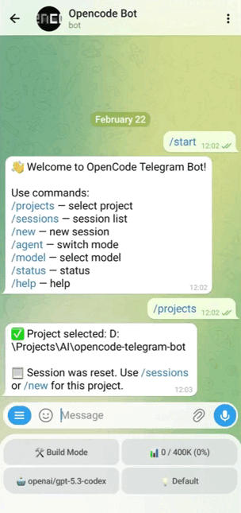

# Reasonix Telegram Bot

[](https://www.npmjs.com/package/@philippthiele/reasonix-telegram-bot)
[](https://github.com/philippthiele/reasonix-telegram-bot/actions/workflows/ci.yml)
[](LICENSE)
[](https://nodejs.org)
[](https://x.com/grin_rus)
[](https://t.me/+Fj_IyKRi6-41MGUy)

Reasonix Telegram Bot is a secure Telegram client for [Reasonix](https://reasonix.ai) CLI that runs on your local machine.

Run AI coding tasks, monitor progress, switch models, and manage sessions from your phone.

No open ports, no exposed APIs. The bot communicates with your local Reasonix server and the Telegram Bot API only.

Platforms: macOS, Windows, Linux

Languages: English (`en`), العربية (`ar`), Deutsch (`de`), Español (`es`), Français (`fr`), Bahasa Indonesia (`id`), Italiano (`it`), 한국어 (`ko`), Português (Brasil) (`pt`), Русский (`ru`), Türkçe (`tr`), 简体中文 (`zh`)

<p align="center">
  
</p>

> I use [boardown](https://github.com/philippthiele/boardown), my open-source Markdown-based task board, to plan and track this project. It stores tasks in plain `.md` files and can be used as a VS Code extension or a desktop app.

## Features

- **Reasonix server support** — talks to the Reasonix HTTP/SSE API directly; the bot manages one `reasonix serve` process per configured project root, see [Reasonix Server Management](#reasonix-server-management)
- **Remote coding** — send prompts to Reasonix from anywhere, receive complete results with code sent as files
- **Session management** — create new sessions or continue existing ones, just like in the TUI
- **Track live session** — follow a live Reasonix CLI session; see [Track Existing Session](#track-existing-session)
- **Background session notifications** — get short notifications when detached or non-current sessions in the current project/worktree reply, ask questions, or request permissions
- **Live status** — pinned message with current project/worktree, model, context usage, and changed files list, updated in real time
- **Model switching** — switch models directly in the chat and browse the full catalog by provider
- **Agent modes** — switch between Plan and Build modes on the fly
- **Subagent activity** — watch live subagent progress in chat, including the current task, agent, model (with variant when set), and active tool step
- **Custom Commands** — run Reasonix custom commands (and built-ins like `init`/`review`) from an inline menu with confirmation
- **Skills Catalog** — browse Reasonix skills from an inline menu and run them immediately or with arguments in the next message
- **Interactive Q&A** — answer agent questions and approve permissions via inline buttons
- **Runtime settings** — use `/settings` to change runtime preferences; see [Runtime Settings](#runtime-settings)
- **Voice prompts** — send voice/audio messages, transcribe them via a Whisper-compatible API, and optionally enable spoken replies in `/settings`
- **File attachments** — send images, PDF documents, and text-based files to Reasonix, including multiple files in one Telegram album
- **Scheduled tasks** — schedule prompts to run later or on a recurring interval; see [Scheduled Tasks](#scheduled-tasks)
- **Message queue** — messages sent while the agent is busy are handed to the Reasonix session inbox and delivered by Reasonix itself, never buffered by the bot; each waiting message is a bottom-keyboard button you can tap to withdraw it; `/detach` leaves waiting messages to the session they were sent to
- **Context control** — tap the bottom 📊 button to see context usage and the latest assistant message's tokens and cost; compact from the details with an inline confirmation
- **Input flow control** — when an interactive flow is active, the bot accepts only relevant input to keep context consistent and avoid accidental actions
- **Git worktree switching** — browse and switch between existing git worktrees for the current repository with `/worktree`
- **Security** — strict user ID whitelist; no one else can access your bot, even if they find it
- **Localization** — UI localization is supported for multiple languages (`BOT_LOCALE`)
- **Docker support** — run the bot as a container while Reasonix stays on the host; see [Docker Deployment](#docker-deployment)
- **Interactive file browser** — use `/ls` to browse files and directories inside the current project, open subdirectories, go back, and download files by tapping them
- **Attach a file to your next prompt** — tap **📎 Attach to next prompt** on a text file in `/ls`, and it is sent to Reasonix together with your next message, once

Planned features currently in development are listed in [Current Task List](PRODUCT.md#current-task-list).

## Prerequisites

- **Node.js 22.14+** — [download](https://nodejs.org)
- **Reasonix** — the `reasonix` CLI (tested against v1.39.x); the bot spawns `reasonix serve` per project root, so the binary must be on `PATH` or set `REASONIX_SERVE_BINARY`
- **Telegram Bot** — you'll create one during setup (takes 1 minute)

## Quick Start

### 1. Create a Telegram Bot

1. Open [@BotFather](https://t.me/BotFather) in Telegram and send `/newbot`
2. Follow the prompts to choose a name and username
3. Copy the **bot token** you receive (e.g. `123456:ABC-DEF1234...`)

You'll also need your **Telegram User ID** — send any message to [@userinfobot](https://t.me/userinfobot) and it will reply with your numeric ID.

### 2. Configure Project Roots

The bot serves one Reasonix instance per project root and starts each one on demand. List the roots it may open in `REASONIX_ROOTS` (comma-separated, absolute paths):

```bash
REASONIX_ROOTS=/home/you/projects/repo-a,/home/you/projects/repo-b
```

When `REASONIX_ROOTS` is unset, the bot uses its own working directory. A session outside the configured roots cannot be opened from Telegram. See [Reasonix Server Management](#reasonix-server-management) for how ports and processes are assigned.

### 3. Install & Run

The fastest way — run directly with `npx`:

```bash
npx @philippthiele/reasonix-telegram-bot@latest
```

> **Note:** This README tracks the `main` branch, which may include unreleased changes. The latest npm release may not include every feature described here yet. See [recent commits on `main`](https://github.com/philippthiele/reasonix-telegram-bot/commits/main).

> Quick start is for npm usage. You do not need to clone this repository. If you run this command from the source directory (repository root), it may fail with `reasonix-telegram: not found`. To run from sources, use the [Development](#development) section.

If required configuration is not supplied through process environment variables or an `.env` file, an interactive wizard will guide you through setup. It asks for the interface language first, then your bot token, user ID, and the default model provider and model ID. After that, you're ready to go: the bot starts a `reasonix serve` instance per configured root on first use. Open your bot in Telegram and start sending tasks.

#### Alternative: Global Install

```bash
npm install -g @philippthiele/reasonix-telegram-bot
reasonix-telegram start
```

`start` runs in the foreground by default. This is the recommended mode for `systemd`, Docker, local debugging, and other external process managers.

To run the bot in the built-in background mode instead:

```bash
reasonix-telegram start --daemon
reasonix-telegram status
reasonix-telegram stop
```

> Built-in daemon mode is intended for standalone npm installs without an external supervisor. For `systemd`, `pm2`, or Docker, keep using `reasonix-telegram start` without `--daemon`.

For Linux `systemd` setup, see [`docs/LINUX_SYSTEMD_SETUP.md`](./docs/LINUX_SYSTEMD_SETUP.md).

To reconfigure at any time:

```bash
reasonix-telegram config
```

## Supported Platforms

| Platform | Status                                       |
| -------- | -------------------------------------------- |
| macOS    | Fully supported                              |
| Windows  | Fully supported                              |
| Linux    | Fully supported (tested on Ubuntu 24.04 LTS) |

## Bot Commands

| Command           | Description                                             |
| ----------------- | ------------------------------------------------------- |
| `/status`         | Bot version, server health, current project, session, and model info |
| `/new`            | Create a new session                                    |
| `/abort`          | Abort the current task                                  |
| `/detach`         | Detach from the current session without stopping it     |
| `/sessions`       | Browse and switch between recent sessions               |
| `/recent`         | Browse recent sessions across projects and worktrees, see their status and attach directly |
| `/messages`       | Browse user messages, revert or fork from a previous state     |
| `/projects`       | Switch between Reasonix projects                        |
| `/worktree`       | Switch between existing git worktrees                   |
| `/open`           | Add a project by browsing directories                   |
| `/ls`             | List directory contents, then tap to open or download   |
| `/settings`       | Change bot settings                                     |
| `/commands`       | Browse and run custom commands                          |
| `/skills`         | Browse and run Reasonix skills                          |
| `/task`           | Create a scheduled task                                 |
| `/tasklist`       | Browse and delete scheduled tasks                       |
| `/reasonix_start` | Start the Reasonix server for the current project root |
| `/reasonix_stop`  | Stop the Reasonix server for the current project root, including during a run |
| `/reload`         | Reload the Reasonix configuration without restarting the server |
| `/help`           | Show available commands                                 |

`/rename` and `/mcps` were removed: Reasonix exposes neither session renaming nor MCP toggling over its server API.

Any regular text message is sent as a prompt to the coding agent only when no blocking interaction is active. Voice/audio messages are transcribed and then sent as prompts when STT is configured.

When the current project is a git repository, `/worktree` shows the existing worktrees for that repository. Status and pinned updates display the main project path with the active branch, and show a separate `Worktree` line when a linked worktree is selected.

## Message History, Revert, and Fork

The `/messages` command displays all user messages in the current session, sorted by time (newest first). Select a message to view its full text and access the **Revert** and **Fork** actions.

**Revert** rolls back the session state to the selected message, discarding all subsequent messages and agent responses. This is useful when you want to retry a different approach from a specific point in the conversation.

**Fork** creates a new session that branches from the selected message. The original session remains unchanged, and you can continue working in the new forked session. This is useful when you want to explore an alternative approach without losing the original conversation history.

## Scheduled Tasks

Scheduled tasks let you prepare prompts in advance and run them automatically later or on a recurring schedule. This is useful for periodic checks, routine code maintenance, or tasks you want Reasonix to execute while you are away from your computer. Use `/task` to create a scheduled task and `/tasklist` to review or delete existing ones.

- Each task is created from the currently selected Reasonix project, model, and agent
- The agent is fixed when the task is created and every run uses it; it is shown in the creation confirmation and in the task details in `/tasklist`
- Tasks run outside your active chat session, so they do not interrupt or affect the current session flow
- The minimum recurring interval is 5 minutes
- If a recurring task is still running when its next interval arrives, the bot does not start a parallel copy of the same task and does not replay missed intervals later
- By default, the bot waits up to 120 minutes for one scheduled task run; change this with `SCHEDULED_TASK_EXECUTION_TIMEOUT_MINUTES` if needed
- Up to 10 scheduled tasks can exist at once by default; change this with `TASK_LIMIT` in your `.env`

## Track Existing Session

After you create a new session, select an existing one, or let the bot auto-create one from your first prompt, the bot automatically starts tracking that session. It follows live events from the same Reasonix session, shows external text input sent from another client, and lets you continue the same session from Telegram.

Sessions belong to a project root, and the bot keeps one Reasonix instance per root, so a session created from the desktop app or the TUI shows up in `/sessions` as long as it lives under a configured root.

**Taking over a session.** Reasonix lets one runtime write to a session at a time. A session the desktop app still holds is watched read-only until the bot takes the writer lease (`POST /resume` then `POST /reclaim`) on your next prompt. This is automatic: you do not have to release the session on the desktop first, but any turn in flight there will be finished before the bot can write.

## Reasonix Server Management

The bot does not expect you to run a Reasonix server yourself. It manages one per project root.

**Per-root instances.** Every root in `REASONIX_ROOTS` gets its own `reasonix serve` process, so projects cannot see each other's sessions. If `REASONIX_ROOTS` is empty the bot serves its working directory only.

**Stable ports.** A root is hashed to a port in the range `47610`–`47809`, so the same root always reuses the same port and the bot can reconnect to an instance it started earlier. Each instance is bound to `127.0.0.1` and started as:

```bash
reasonix serve --addr 127.0.0.1:<port> --auth token --token <generated>
```

**Token auth.** Each root gets its own generated token, so access is scoped to that instance. A token is never taken from the environment or written to disk in plaintext; the port-to-root mapping is persisted under the app home with mode `600`.

**Reuse over restart.** Before spawning, the bot checks whether something is already listening on the root's port. If so it reuses that process instead of leaking a new one.

**Health.** There is no dedicated health route. The bot treats a successful `GET /models` response — which carries a model list, so it proves the instance is both up and serving that root — as healthy. Set `REASONIX_SERVE_BINARY` if the `reasonix` binary is not on `PATH`.

Use `/reasonix_start` and `/reasonix_stop` to start or stop the current root's instance from Telegram.

## Configuration

### Localization

- Supported locales: `en`, `ar`, `de`, `es`, `fr`, `id`, `it`, `ko`, `pt`, `ru`, `tr`, `zh`
- The setup wizard asks for language first
- You can change locale later with `BOT_LOCALE`

### Local JSON Commands

Trusted local commands live in `<appHome>/local-commands/`, one JSON file per command. The filename becomes the command name, so `quota.json` appears as `/quota` in Telegram’s command menu after the bot restarts:

```json
{
  "description": "Show provider quota limits",
  "exec": "node /home/you/bin/quota.js",
  "allowWhenBusy": true
}
```

`description` and `exec` are required; `description` is a single line of at most 256 characters. Extra fields are ignored. Commands run through the platform shell with the bot’s OS permissions and inherited environment, from `<appHome>`; treat every file in this directory as trusted code. They receive no Telegram text or attachments, never invoke Reasonix, time out after 30 seconds, and are not listed in `/help` or `/commands`. `allowWhenBusy` defaults to `false`; it permits a command while Reasonix is working but never during an active bot interaction.

### Environment Variables

Configuration can be provided through process environment variables or an `.env` file. Process environment values take precedence. When installed via npm, the configuration wizard handles any missing required values and stores the generated `.env` file in your platform's app data directory:

- **macOS:** `~/Library/Application Support/reasonix-telegram-bot/.env`
- **Windows:** `%APPDATA%\reasonix-telegram-bot\.env`
- **Linux:** `~/.config/reasonix-telegram-bot/.env`

| Variable                                   | Description                                                                                                           | Required | Default                  |
| ------------------------------------------ | --------------------------------------------------------------------------------------------------------------------- | :------: | ------------------------ |
| `TELEGRAM_BOT_TOKEN`                       | Bot token from @BotFather                                                                                             |   Yes    | —                        |
| `TELEGRAM_ALLOWED_USER_ID`                 | Your numeric Telegram user ID                                                                                         |   Yes    | —                        |
| `TELEGRAM_PROXY_URL`                       | SOCKS or HTTP(S) forward proxy for Telegram Bot API calls and file downloads                                         |    No    | —                        |
| `TELEGRAM_API_ROOT`                        | Custom Telegram Bot API root URL (e.g. nginx reverse-proxying `api.telegram.org`); applied to API calls and file downloads | No | `https://api.telegram.org` |
| `TELEGRAM_PROXY_SECRET`                    | Shared secret sent as `X-Proxy-Secret` header on every Bot API request and file download (used with `TELEGRAM_API_ROOT`) | No | —                        |
| `TELEGRAM_FORCE_IPV4`                      | Force IPv4 for direct Telegram API and file requests; useful when IPv6 DNS works but outbound IPv6 is broken           |    No    | `false`                  |
| `REASONIX_ROOTS`                          | Comma-separated absolute project roots the bot may serve; one Reasonix instance per root            |    No    | the bot's working directory |
| `REASONIX_SERVE_BINARY`                    | Path to the `reasonix` binary the bot spawns for each root                                          |    No    | `reasonix`                |
| `REASONIX_MODEL_PROVIDER`                  | Default model provider                                                                                                |   Yes    | —                         |
| `REASONIX_MODEL_ID`                        | Default model ID                                                                                                      |   Yes    | —                         |
| `BOT_LOCALE`                               | Bot UI language (supported locale code, e.g. `en`, `ar`, `de`, `es`, `fr`, `id`, `it`, `ko`, `pt`, `ru`, `tr`, `zh`)  |    No    | `en`                     |
| `SESSIONS_LIST_LIMIT`                      | Sessions per page in `/sessions` and maximum sessions in `/recent`                                                    |    No    | `10`                     |
| `MESSAGES_LIST_LIMIT`                      | User messages per page in `/messages`                                                                                 |    No    | `10`                     |
| `PROJECTS_LIST_LIMIT`                      | Projects per page in `/projects`                                                                                      |    No    | `10`                     |
| `PROJECTS_EXCLUDED_PATHS`                  | Comma-separated absolute paths hidden from `/projects` (exact worktree match)                                        |    No    | *(none)*                 |
| `OPEN_BROWSER_ROOTS`                       | Comma-separated paths `/open` is allowed to browse (supports `~`)                                                     |    No    | `~` (home directory)     |
| `COMMANDS_LIST_LIMIT`                      | Items per page in `/commands` and `/skills`                                                                           |    No    | `10`                     |
| `MODELS_LIST_LIMIT`                        | Providers and provider models per page in the model picker                                                            |    No    | `10`                     |
| `TASK_LIMIT`                               | Maximum number of scheduled tasks that can exist at once                                                              |    No    | `10`                     |
| `SCHEDULED_TASK_EXECUTION_TIMEOUT_MINUTES` | Maximum time the bot waits for one scheduled task run before marking it failed                                        |    No    | `120`                    |
| `SCHEDULED_TASK_DISABLE_NOTIFICATION`      | Send scheduled task result/error messages without Telegram push notifications                                         |    No    | `false`                  |
| `BASH_TOOL_DISPLAY_MAX_LENGTH`             | Maximum displayed length for `bash` tool commands in Telegram summaries; longer commands are truncated                |    No    | `128`                    |
| `TRACK_BACKGROUND_SESSIONS`                | Track detached/non-current sessions in the current selected project/worktree and send short notifications             |    No    | `true`                   |
| `MESSAGE_FORMAT_MODE`                      | Assistant reply formatting mode: `markdown` (native Telegram rich blocks) or `raw` (plain text)                       |    No    | `markdown`               |
| `MESSAGE_MERGE_WINDOW_MS`                  | Merge Telegram-split long text messages into one prompt after this wait window (ms); `0` disables merging             |    No    | `1500`                   |
| `INITIAL_SETTINGS_PRESET`                  | JSON object that seeds default `/settings` values on first run (keys not yet persisted); see [Runtime Settings](#runtime-settings) |    No    | `{}`                     |
| `CODE_FILE_MAX_SIZE_KB`                    | Max file size (KB) to send as document                                                                                |    No    | `100`                    |
| `STT_API_URL`                              | Whisper-compatible API base URL (enables voice/audio transcription)                                                   |    No    | —                        |
| `STT_API_KEY`                              | API key for your STT provider                                                                                         |    No    | —                        |
| `STT_MODEL`                                | STT model name passed to `/audio/transcriptions`                                                                      |    No    | `whisper-large-v3-turbo` |
| `STT_LANGUAGE`                             | Optional language hint (empty = provider auto-detect)                                                                 |    No    | —                        |
| `STT_REQUEST_FORMAT`                       | STT request format: `multipart` (standard OpenAI/Groq Whisper) or `json` (base64 `input_audio` body, e.g. OpenRouter) |    No    | `multipart`              |
| `STT_NOTE_PROMPT`                          | Optional note prepended to the LLM prompt as `[Note: ...]` for voice transcriptions; empty / `false` / `0` disable it |    No    | —                        |
| `DOC_EXTRACTOR_URL`                        | Document text extraction API URL (enables PDF/DOCX/PPTX extraction)                                                    |    No    | —                        |
| `DOC_EXTRACTOR_API_KEY`                    | API key for the document extractor (optional for self-hosted extractors)                                                |    No    | —                        |
| `TTS_PROVIDER`                             | TTS provider: `openai` for OpenAI-compatible APIs, `elevenlabs` for ElevenLabs, or `google` for Google Cloud TTS      |    No    | `openai`                 |
| `TTS_API_URL`                              | TTS API base URL for OpenAI-compatible APIs or ElevenLabs                                                             |    No    | —                        |
| `TTS_API_KEY`                              | TTS API key for OpenAI-compatible APIs or ElevenLabs                                                                  |    No    | —                        |
| `TTS_MODEL`                                | TTS model name. Passed as `model` for OpenAI-compatible APIs and `model_id` for ElevenLabs                            |    No    | `gpt-4o-mini-tts`        |
| `TTS_VOICE`                                | TTS voice name or ElevenLabs voice ID. Defaults to `alloy`, `21m00Tcm4TlvDq8ikWAM`, or `en-US-Studio-O` by provider   |    No    | provider-specific        |
| `GOOGLE_APPLICATION_CREDENTIALS`           | Path to a Google Cloud service account JSON key file for `TTS_PROVIDER=google`                                        |    No    | —                        |
| `LOG_LEVEL`                                | Log level (`debug`, `info`, `warn`, `error`)                                                                          |    No    | `info`                   |
| `LOG_RETENTION`                            | Number of log files to keep: launch files in `sources`, daily files in `installed`                                    |    No    | `10`                     |

> **Keep your `.env` file private.** It contains your bot token. Never commit it to version control.

Logs are written to `./logs` when running from sources and to the runtime config directory `logs/` folder in `installed` mode. Log rotation depends on runtime mode: `sources` creates one file per bot launch, while `installed` appends to one file per day. Old log files are removed according to `LOG_RETENTION`.

### Runtime Settings

Runtime preferences are changed from `/settings` and stored in `settings.json`:

- Compact output mode: one progress message per stretch of work between replies and prompts, from the moment the model starts thinking or writing in that stretch. It is removed or marked finished when the reply or prompt lands, or when the run ends if nothing followed
- Delete progress on finish: available while compact output mode is on, removes each of those progress messages when that stretch finishes
- Thinking content display
- Assistant run footer display
- Pin session dashboard
- Diff file attachments
- Response streaming mode: `edit` or `draft (experimental)`; applies only to final assistant replies, not thinking messages
- Audio replies: `off`, `all`, or `auto` when TTS is configured
- Message queue: `Off` or `Queue` (off by default) — what happens to text, voice, photos, rich formatted messages with photos, documents, and media groups sent while the agent is busy

With the message queue on, text, transcribed voice, photos, rich formatted messages with photos, supported documents, and media groups sent while the agent is busy are accepted instead of being turned down. A waiting message is handed straight to the Reasonix session inbox and **nothing is buffered by the bot** — Reasonix delivers it. There is therefore no queued-media size limit, and a bot restart does not lose waiting messages, only their buttons. The bot keeps a mirror of the inbox so it can show waiting messages and let you withdraw one.

`Steer` is not offered: Reasonix cannot steer a running turn. The client submits a turn directly (`POST /submit`) when the session is free and falls back to the inbox when Reasonix answers `409`, so a message sent while busy always waits for the current run to finish and then starts its own run.

At most `MAX_QUEUED_PROMPTS` (5) waiting messages are tracked at a time. Waiting messages appear as buttons above the usual bottom-keyboard grid — tap one to withdraw it. `/abort`, `/reasonix_stop` or a session/project switch withdraws them all. When a waiting message is picked up, its button disappears and its text is quoted as external user input.

`/detach` does not withdraw them: they stay with the detached session and reach it as if the bot had stayed attached, with the agent and model selected at `/detach` — a message still being transcribed or downloaded included. Their buttons leave the keyboard and they no longer count toward the limit. A later session or project switch leaves them alone; `/abort` after returning to that session, or `/reasonix_stop`, withdraws them. Picked up while detached, they show nothing in the chat beyond the usual background notification; back in the session before pickup, each is quoted as external user input when it starts.

You can seed the initial defaults for any of these settings without hard-coding them in your Docker image by setting `INITIAL_SETTINGS_PRESET` to a JSON object. Only keys not yet persisted in `settings.json` are affected — settings the user has already changed via `/settings` are left untouched:

```env
INITIAL_SETTINGS_PRESET={"showAssistantRunFooter":false,"compactOutputMode":true,"ttsMode":"auto","pinnedDashboardEnabled":true}
```

Settings are written atomically: the new content goes to a temporary file that then replaces `settings.json`, and the previous version is kept as `settings.json.bak`. A crash during a write can never leave a truncated file — the bot falls back to the backup on the next start. If both `settings.json` and `settings.json.bak` are unreadable, the bot refuses to start instead of overwriting them, and the error names the file so you can fix or remove it manually.

### Reverse Proxy (Optional)

For environments that block `api.telegram.org` but allow your own HTTPS endpoint (corporate networks, restricted regions), you can route Bot API traffic through a reverse proxy you control. This is an alternative to the SOCKS/HTTP forward proxy configured with `TELEGRAM_PROXY_URL`.

Set `TELEGRAM_API_ROOT` to your reverse-proxy URL — both Bot API calls and file downloads (including voice/audio files) will use it. Optionally set `TELEGRAM_PROXY_SECRET` so the bot sends an `X-Proxy-Secret` header your proxy can use to authorize callers.

`.env`:

```env
TELEGRAM_API_ROOT=https://tg-proxy.yourdomain.com
TELEGRAM_PROXY_SECRET=some-long-random-string
```

Example nginx config:

```nginx
server {
    listen 443 ssl http2;
    server_name tg-proxy.yourdomain.com;

    ssl_certificate     /etc/letsencrypt/live/tg-proxy.yourdomain.com/fullchain.pem;
    ssl_certificate_key /etc/letsencrypt/live/tg-proxy.yourdomain.com/privkey.pem;

    access_log off;  # the bot token appears in URL paths
    client_max_body_size 50m;

    if ($http_x_proxy_secret != "some-long-random-string") { return 403; }

    location / {
        proxy_pass https://api.telegram.org;
        proxy_ssl_server_name on;
        proxy_set_header Host api.telegram.org;
    }
}
```

`TELEGRAM_API_ROOT` and `TELEGRAM_PROXY_URL` are alternative connectivity modes — the former picks the URL the bot connects to (a reverse proxy on your side), while the latter tunnels TCP through a forward proxy. Configure only one of them; the bot rejects using both at startup.

### Force IPv4 for Telegram (Optional)

If the bot fails during startup with errors such as `Network request for 'setMyCommands' failed` or `Network request for 'getWebhookInfo' failed`, and the same machine has broken outbound IPv6 connectivity, force direct Telegram requests to use IPv4:

```env
TELEGRAM_FORCE_IPV4=true
```

This affects direct Bot API calls and Telegram file downloads. It is not a replacement for `TELEGRAM_PROXY_URL` or `TELEGRAM_API_ROOT` when Telegram is blocked by the network.

### Voice and Audio Transcription (Optional)

If `STT_API_URL` and `STT_API_KEY` are set, the bot will:

1. Accept `voice` and `audio` Telegram messages
2. Transcribe them via `POST {STT_API_URL}/audio/transcriptions`
3. Show recognized text in chat
4. Send the recognized text to Reasonix as a normal prompt

If `STT_NOTE_PROMPT` is set to a non-empty value other than `false` or `0`, the bot prepends `[Note: ...]` to the transcription before sending it to the LLM. The recognized text shown in Telegram stays unchanged.

If TTS credentials are configured, you can choose spoken reply behavior in `/settings`: `off` disables audio replies, `all` sends audio for every assistant reply, and `auto` sends audio only after voice/audio prompts. The preference is stored in `settings.json` and persists across restarts.

OpenAI-compatible TTS configuration example:

```env
TTS_PROVIDER=openai
TTS_API_URL=https://api.openai.com/v1
TTS_API_KEY=your-tts-api-key
TTS_MODEL=gpt-4o-mini-tts
TTS_VOICE=alloy
```

ElevenLabs TTS configuration example:

```env
TTS_PROVIDER=elevenlabs
TTS_API_URL=https://api.elevenlabs.io/v1
TTS_API_KEY=your-elevenlabs-api-key
TTS_MODEL=eleven_flash_v2_5
TTS_VOICE=21m00Tcm4TlvDq8ikWAM
```

Google Cloud TTS configuration example:

```env
TTS_PROVIDER=google
TTS_VOICE=en-US-Studio-O
GOOGLE_APPLICATION_CREDENTIALS=/path/to/service-account-key.json
```

Supported provider examples (Whisper-compatible):

- **OpenAI**
  - `STT_API_URL=https://api.openai.com/v1`
  - `STT_MODEL=whisper-1`
- **Groq**
  - `STT_API_URL=https://api.groq.com/openai/v1`
  - `STT_MODEL=whisper-large-v3-turbo`
- **Together**
  - `STT_API_URL=https://api.together.xyz/v1`
  - `STT_MODEL=openai/whisper-large-v3`

If STT variables are not set, voice/audio transcription is disabled and the bot will ask you to configure STT.

### Document Text Extraction (Optional)

If `DOC_EXTRACTOR_URL` is set, the bot will extract text from PDF, DOCX, PPTX, and other document files using an external API when the current model does not natively support document input.

The API contract is:

- **Endpoint:** `POST {DOC_EXTRACTOR_URL}`
- **Content-Type:** `multipart/form-data`
- **Field:** `file` — the document binary
- **Authorization:** `Bearer {DOC_EXTRACTOR_API_KEY}` (only sent when a key is configured)
- **Response:** JSON `{ "text": "extracted content..." }`

If the extractor is not configured and the model doesn't support documents, the bot replies with a notice and forwards only the caption text.

### Model Configuration

Reasonix keeps no favorites or recent-model history, so the model picker has no persisted list: the top of the picker shows just the currently selected model, and the full catalog is reached by provider.

- The current model is marked with `✅`
- The default model from `REASONIX_MODEL_PROVIDER` + `REASONIX_MODEL_ID` is the selection until you pick another one
- Tap **🗂 Providers** in the model picker: it lists the connected providers, then the models of the selected one, both paginated by `MODELS_LIST_LIMIT`
- Only models Reasonix currently offers are listed; a provider with no models left is hidden

## Security

The bot enforces a strict **user ID whitelist**. Only the Telegram user whose numeric ID matches `TELEGRAM_ALLOWED_USER_ID` can interact with the bot. Messages from any other user are silently ignored and logged as unauthorized access attempts.

Since the bot runs locally on your machine and connects to your local Reasonix server, there is no external attack surface beyond the Telegram Bot API itself.

## Development

### Running from Source

```bash
git clone https://github.com/philippthiele/reasonix-telegram-bot.git
cd reasonix-telegram-bot
npm install
cp .env.example .env
# Edit .env with your bot token, user ID, and model settings
```

Build and run:

```bash
npm run dev
```

### Docker Deployment

The bot can also be run as a container using Docker and Docker Compose. The image contains **only the Telegram bot**; the `reasonix` binary must be reachable inside the container, either from a mounted build or from the host. `/reasonix_start` and `/reasonix_stop` do not work from inside the container.

```bash
git clone https://github.com/philippthiele/reasonix-telegram-bot.git
cd reasonix-telegram-bot
cp .env.example .env
# Edit .env with your bot token, user ID, and model settings
```

`.env` stays on the host. It is injected at runtime and is not copied into the image.

**Linux** (host networking, so the spawned `reasonix serve` instances stay on loopback):

```bash
docker compose up -d --build
```

**macOS / Windows (Docker Desktop):** host networking is not supported there. Use the Desktop override, which switches to the default bridge network:

```bash
docker compose -f docker-compose.yml -f docker-compose.desktop.yml up -d --build
```

Follow logs:

```bash
docker compose logs -f reasonix-bot
```

Stop:

```bash
docker compose down
```

#### Persistence

Runtime state (settings, logs, and the Reasonix instance port/token map) is stored in a Docker named volume `reasonix-bot-data` mapped to `/app/data` inside the container. The volume is created automatically on first run. It is the bot's own state, not your project files; project edits still happen on whatever disk the roots point at.

#### Configuration

All configuration is provided through environment variables in the `.env` file. Compose also sets `REASONIX_TELEGRAM_CONTAINER=1` so the bot can warn about commands that need the host filesystem or a local Reasonix process.

The bot starts its own `reasonix serve` per root, so `reasonix` must be reachable inside the container. The default image does not bundle the Reasonix binary: either point `REASONIX_SERVE_BINARY` at a Reasonix build mounted into the container, or run Reasonix on the host and keep the roots on a shared volume. Set `REASONIX_ROOTS` to the container-visible paths of your projects.

#### Commands that are not available in Docker

These need the bot process to see host project paths or to spawn/stop `reasonix serve` in the same machine namespace. The default image does neither, so the bot replies with a warning instead of a generic error:

- `/open` — directory browser to add a project
- `/ls` — project file browser / download / attach
- `/reasonix_start` and `/reasonix_stop`
- `/worktree`

`/projects`, `/sessions`, prompts, and live updates still go through the Reasonix HTTP API and work as usual.

Ports `47610`–`47809` are **not** exposed by the bot image; they belong to the Reasonix instances the bot spawns, which stay on the container's loopback interface.

### Available Scripts

| Script                          | Description                          |
| ------------------------------- | ------------------------------------ |
| `npm run dev`                   | Build and start (development)        |
| `npm run build`                 | Compile TypeScript                   |
| `npm start`                     | Run compiled code                    |
| `npm run release:prepare`       | Bump version and seed release notes  |
| `npm run release:notes:preview` | Preview auto-generated release notes |
| `npm run lint`                  | ESLint check (zero warnings policy)  |
| `npm run typecheck`             | Type-check `src` and `tests`         |
| `npm run format`                | Format code with Prettier            |
| `npm test`                      | Run tests (Vitest)                   |
| `npm run test:coverage`         | Tests with coverage report           |

> **Note:** No file watcher or auto-restart is used. The bot maintains persistent SSE and long-polling connections — automatic restarts would break them mid-task. After making changes, restart manually with `npm run dev`.

## Troubleshooting

**Bot doesn't respond to messages**

- Make sure `TELEGRAM_ALLOWED_USER_ID` matches your actual Telegram user ID (check with [@userinfobot](https://t.me/userinfobot))
- Verify the bot token is correct

**"Reasonix server is not available"**

- Check that the `reasonix` binary is on the bot machine's `PATH`, or set `REASONIX_SERVE_BINARY` to its full path. The bot logs the spawn error when it cannot start it.
- Check that the project path is inside a configured `REASONIX_ROOTS` entry, or add it. A session outside the roots is never opened.
- Use `/reasonix_start` to start the current root's instance from Telegram and `/status` to see its health.
- In a container, confirm the binary and the project roots are visible inside the container, not only on the host.
- A bind failure on the root's port (already taken by an unrelated process) is reported per root in the bot log; the bot reuses whatever already listens on that port instead of starting a second one.

**No models in model picker**

- Confirm Reasonix offers at least one provider and model: run `reasonix serve` and check `/models`, or open the Reasonix TUI model selection
- Verify `REASONIX_MODEL_PROVIDER` and `REASONIX_MODEL_ID` point to an available model in your setup

**Linux: permission denied errors**

- Make sure the CLI binary has execute permission: `chmod +x $(which reasonix-telegram)`
- Check that the config directory is writable: `~/.config/reasonix-telegram-bot/`

## Contributing

Please follow commit and release note conventions in [CONTRIBUTING.md](CONTRIBUTING.md).

## Community

Have questions, want to share your experience using the bot, or have an idea for a feature? Join the [Telegram group](https://t.me/+Fj_IyKRi6-41MGUy) for announcements and discussions, or start a thread in [GitHub Discussions](https://github.com/philippthiele/reasonix-telegram-bot/discussions).

## Support

This project is free and open source. Development and testing run on paid AI model subscriptions, and donations go directly toward those.

If you find this bot useful, you can support it here: [Donate](https://donate.trybit.com/D9J1UVKT)

Any amount helps — thank you!

## License

[MIT](LICENSE) © Ruslan Grinev
